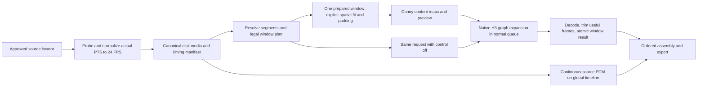

# Architecture proposal

**M0 design only.** Nothing below is an implemented extension, node, module or running service. [The brief](PROJECT_BRIEF.md) is authoritative; [research](RESEARCH.md) records source facts/unknowns; [contracts](CONTRACTS.md) defines proposed version 1.0.0 boundaries. **GPU validation NOT PERFORMED.**

## Recommended path

Start with a disk-backed media pipeline and a thin native H3 graph adapter. Prove one small Canny-controlled clip and its control-off counterpart before a timeline editor. Keep source RGB outside all appearance/reference/guide/inpainting sockets. Preserve original audio by assembly, not by injecting it into H3.

| Approach | Tradeoff | Decision |
|---|---|---|
| Native graph expansion per bounded window; normal visible queue coordination for a project selection | Keeps native sampler/model/progress/error behavior and allows disk boundaries. Queue/ledger recovery and cache lifetime must be verified | Recommended. M1 can submit one window manually; M2 adds the small selection coordinator after GPU gate |
| One fully expanded graph containing every window | One prompt for a project; explicit dependency links can serialize sampling | Candidate only. Cached tensors may scale with input length; do not claim bounded RAM without evidence or change global cache policy silently |
| Monolithic sampler loop or adopt a Director as execution engine | Faster apparent UI reuse, but hides executor stages and introduces reference/continuation/passthrough semantics | Do not use for first path; selected Director code is UI/planning research, not our backend |

No native backend node posts recursive HTTP prompts into its own queue. A future frontend coordinator submits ordinary, visible, owned window prompts serially through supported ComfyUI client APIs; validates that API at the chosen frontend revision; tracks their IDs and durable receipts. This is an explicit user run, not a hidden background service. If browser-independent batching is later desired, evaluate supported native expansion/cache behavior separately.

## Responsibility boundaries

All areas/names below are **proposed**, including package paths. Foundation owns the initial shared package/schema surface; downstream ownership begins only from an integrated checked SHA.

| Responsibility | Proposed area / logical interface | Owned result |
|---|---|---|
| Foundation | `schemas/`, `kmin_video_director/contracts/`, root package registration/metadata/dependency files; ResolveProject and version/error helpers | One shared typed contract and importable future skeleton, documented license decision and conformance examples |
| Media/planning/assembly | `kmin_video_director/media/`, `planning/`, `assembly/`; ProbeMedia, NormalizeMedia, PlanWindows, PrepareWindow, AssembleExport | Correct actual-time canonical source, legal plan, bounded disk media, frame/sample-accurate export |
| Control/native adapter | `kmin_video_director/controls/`, `adapters/`, `nodes/m1/`; BuildControl, ExpandNativeRender, FinalizeWindow | Canny preview and native H3 result through standard graph/queue with strict profile validation |
| Editor | `web/`; project/segment widgets and state | Minimal source player, markers, local prompts and workflow persistence |
| Selection/recovery | `kmin_video_director/runtime/`, `nodes/run/`, `web/run/`; RunSelection | Serial owned requests, progress/cancel/retry, checked assembly and receipt ledger |

A task's owner also owns its ordinary tests and docs. New dependencies/shared schema changes return to the foundation owner; consumers never edit lockfiles concurrently. Files are not created in M0.

## Media and planning

Probe approved media streams, actual presentation timestamps, last-frame endpoint, audio effective start, display matrix and sample aspect. Record immutable content fingerprints. Normalize the complete source once as a streamed disk artifact at 24/1 with the contract's F and PTS policy; keep the original untouched. A metadata-only frame-rate change cannot satisfy this operation. FFmpeg is a candidate subprocess backend; chosen binary/build/version must be authorized, recorded and checked in M1, with argument arrays suitable for Unicode/spaces and no shell-built command strings.

Segments cover `[0,F)` exactly. Windows partition each segment's useful range. The pinned native capability confirms the lattice; our strict maximum is derived from 15 seconds including all padding/context. Balance technical splits inside each segment; don't redistribute useful frames across a prompt change or real cut. M1 has no continuation context. Every window carries frozen settings, profile, input span map and output-useful range. Validate before native graph creation, and reject unexpected decoded counts afterward.

Preserve displayed dimensions by default. Bake orientation/SAR once; fit and letterbox to a multiple-of-32 canvas. Warn before an oversized configuration; an explicit Draft/max-megapixels policy is separate from default fidelity. RGB and control use the same coordinate mapping. Generate Canny on content before map padding to avoid pad-border edges; assert maps are already exactly the requested native canvas. Crop only declared service padding after decode. Codec limitations and odd dimensions produce a user-visible choice, not a silent resize.

Long input is never loaded as one IMAGE tensor. Preparation streams; only one bounded window is materialized at a time. Use disk thumbnails/proxies for UI. Estimated image tensor bytes are merely preflight estimates, not a measured H3 memory fit.

## Native H3 adapter

Use the [pinned template](https://github.com/Comfy-Org/workflow_templates/blob/0e5c5efb32ba6f3365d6da07da64aaf668157042/templates/video_minimax_h3_fun_controlnet_union.json) as the source recipe. First compatibility profile follows its Ref2VA base plus original converted Union and exact text/video/audio VAE components. References remain empty. Native Canny replaces the pose producer. Source-only native v2 accommodation is documented; it is an optional profile requiring matching block count, injection positions, AdaLN form, quantization and normalization metadata, not an automatic upgrade.

The expanded window graph has model/CLIP/VAE links, native text conditioning with empty references, AV latent, sigma shift, structural patch, standard guider/sampler/scheduler, native AV decode and a checked window finalizer. GraphBuilder IDs are deterministic within execution and mapped back to stable window IDs. The finalizer exports disk artifacts and small manifests; it removes temporal padding/context and spatial service padding, records observed counts and returns an ordering token.

No source RGB or audio is connected to reference, keyframe/guide or inpaint inputs. `control_video` receives maps only; `source_video` and mask remain absent. Control-off bypasses patch application with all other effective settings unchanged. Low/high thresholds, strength and denoising schedule are visible, frozen and fingerprinted. Defer turbo LoRA, sparse attention, prompt rewriting, refiners and alternate modes until separate evidence supports them.

Check required node schema signatures and installed component identities. A minimum version label alone is insufficient. Missing/mismatched models, dropped control keys or incompatible kernels block clearly; no automatic weight download, conversion, substitute checkpoint, OOM downscale or environment mutation.

## Queue, lifetime and interruption

M1 uses a normal ComfyUI queue submission and native expansion for a bounded clip. Real 15-second/multiwindow evidence can run bounded prompts sequentially and assemble their checked results. M2 owns selection coordination: at most one active H3 window, no cross-project GPU concurrency promised, owned prompt IDs only, and a disk receipt after each completed window.

Combine native node/sampler progress with explicit media/window stages; show completed validated windows independently from an in-flight percentage. Cancellation targets the owned prompt and interrupts preparation/export between bounded operations. Kill only the task-owned media subprocess; preserve existing results; leave partial output inactive. A refreshed UI reconciles its request IDs with queue/history/ledger before resubmitting. Retry creates a new attempt with deterministic effective settings; edits mark old outputs stale.

Use native ModelPatcher/model management through the normal nodes. Never call global unload/cache clears as routine extension cleanup. Native intermediate caching is a material risk: serial order and disk finalization do not prove tensor release. M1 measures RAM/VRAM for repeated bounded windows and confirms previous image/latent tensors cease accumulating between window prompts. If native cache behavior fails that criterion, limit support to the measured bounded path and revise the coordinator before long-video execution. Do not install a global cache flag to conceal the issue.

## Audio and export

Preserve source audio by one global disk PCM timeline with original offset and gaps. Splice absolute sample boundaries, encode once for final export. The model can still generate its joint AV stream; preserve/mute choose which audio is exported and do not promise lip sync. Generate mode trims decoded window audio to useful time, resamples to a declared export rate and records its correction; independent windows may have audible seams. Mute has no audio track unless silence was expressly selected.

Assemble checked active results in useful-frame order. Missing/stale/failed windows block full export and identify their ranges. Selected-only preview can report partial coverage; an explicit passthrough is visibly labeled and cannot count as GPU generation. Atomic export records decoded frame count, actual PTS spacing, dimensions, global sample count, effective codec presentation delay and checksums. Verify impulses near the beginning, every boundary and end to distinguish one codec delay from accumulated audio shift.

## Minimal UI after the gate

Use ComfyUI's extension mechanism ([pinned JavaScript overview](https://github.com/Comfy-Org/docs/blob/1a33102d8b046b26644981ee2f4f8a1b99223fbc/custom-nodes/js/javascript_overview.mdx)); no core patch or separate server. One main project node stores versioned serialized project state in workflow widgets/properties; large media remains external. Render a player/proxy, 24 FPS scale, cursor, split markers, a selected segment panel, visible inherited/overridden prompt/control/seed/audio, and real run/cancel/retry/export actions.

Moving a marker updates two adjacent half-open intervals atomically. Numeric edits use integer frame counts with displayed seconds. Save/reload retains IDs, drafts and media fingerprints; a missing asset shows its error and an explicit relink action. Unsupported future mode drafts can be preserved without enabling a fake execution button. No complex multitrack editor, character-reference requirement or hidden prompt transformation.

## Gates and unresolved decisions

Human review of M0 precedes M1 assignment. Shared foundation is integrated first, then media and adapter outcomes, then a named sequential GPU owner runs the sample/control-off comparison. The large M2 editor waits for a reviewed real M1 receipt; if GPU cannot run, record **NOT PERFORMED** and the exact blocker and return the gate decision to the human. That status does not automatically unlock implementation.

The first worker assignments must name a checked common SHA, approved resource environment, matched installed-model profile, test media authorization and publication scope. Windows is the target; no mandatory WSL. No installed target/runtime/profile can be inferred from an AO/cloud workspace. Project licensing, target GPU fit, mixed controls, v2 actual key/loading compatibility and long-run cache release remain explicit evidence gates, not promises.
