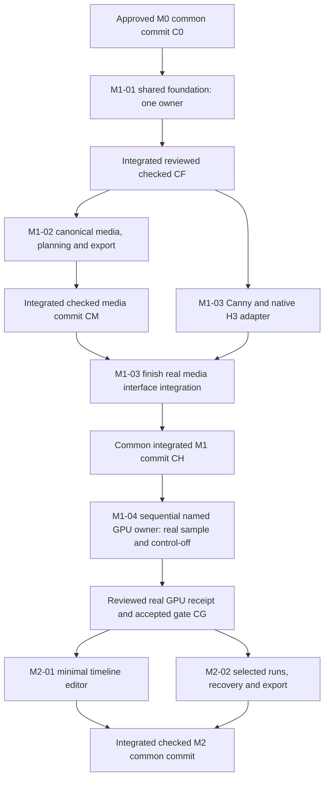

# M1/M2 implementation proposal

**M0 handoff only. No implementation or GPU validation has occurred. GPU validation NOT PERFORMED.** The plan is ready for human review, not permission to execute its tasks. [Brief](PROJECT_BRIEF.md), [research](RESEARCH.md), [architecture](ARCHITECTURE.md), [contracts 1.0.0](CONTRACTS.md) and [task journal](tasks/INDEX.md) are the input package. Proposed package: ComfyUI-KMIN-VideoDirector, Windows-first, no mandatory WSL or paid API.

Goal: prove short source → actual 24 FPS → exact legal window plan → Canny → native H3 → useful-frame/audio export and control-off comparison, then build the smallest useful VID2VA editor. Full multimode/reference support and continuation are later research.

## Sequence and common commits

Base B0 is `8e8cf7253862f94b7787d7065babf2878064ef82`. C0 means the **human-reviewed integrated M0 documentation commit**, not a worker's unmerged branch. It cannot name its own final SHA inside this same commit; the coordinator must record the exact SHA in the journal/assignment after integration. Subsequent labels are also integration milestones, never presumed files from another branch.

- Foundation has **one first owner** for schemas, package metadata, dependencies/lockfiles, registration skeleton and shared helpers. No downstream implementation before CF is integrated, checked and separately reviewed.
- At most **two simultaneous implementing workers**, the user's starting policy. After CF, media and adapter may work on the same checked base with their agreed interfaces; adapter's integration finish waits for CM. It cannot assume media code exists on CF. Its final result is integrated into CH with CM before GPU work.
- A separate AO reviewer reviews future code; fixes return to each owner. Reviewer is not a second implementation owner. Do not let review/integration change the common contract without foundation coordination.
- GPU validation/ComfyUI changes are sequential, owned by one **named AO session** recorded before start. Currently unassigned and unreserved. Worktrees do not isolate GPU, ports, output, venv or model settings. Cloud capability is unknown.
- M2 starts only from CG after real M1 acceptance. An explicit GPU NOT PERFORMED report documents a blocker; it does not automatically open the large editor gate. If resources cannot be provided, the human decides whether to revise scope.
- No M1/M2 worker, reviewer, GPU process or nested orchestrator is launched by M0.

## Outcome-sized task summaries

The linked cards include scope/non-goals, exact read paths, proposed output areas, dependencies/common-base rules, interfaces, acceptance/resources/publication and blockers. Each owner owns the outcome plus its ordinary tests/docs.

| ID | Outcome | Proposed owner / starts from | Exit evidence |
|---|---|---|---|
| [M1-01](tasks/M1-01-FOUNDATION.md) | Versioned shared foundation and license/dependency decisions | One foundation owner, C0 | Serialization/validation/import checks and separate review → CF |
| [M1-02](tasks/M1-02-MEDIA.md) | Real CFR media, balanced legal windows, spatial/audio-accurate CPU export | Media owner, CF | Synthetic media frame/PTS/sample/dimension receipts plus ordinary tests → CM |
| [M1-03](tasks/M1-03-H3.md) | Canny and native graph adapter with strict compatibility/receipts | Adapter owner, CF; final integration on CM | Controlled inputs/empty refs, normal execution events and exact finalization; mocks labeled, then CH |
| [M1-04](tasks/M1-04-GPU-GATE.md) | Real controlled/control-off sample on an authorized matched environment | Named GPU resource owner, CH | Actual H3 output, timings/memory/count/audio/wiring receipt reviewed → CG |
| [M2-01](tasks/M2-01-EDITOR.md) | Minimal VID2VA source/marker/prompt editor and workflow persistence | Editor owner, CG | Real browser state/actions, marker conservation/save/reload/missing-media checks |
| [M2-02](tasks/M2-02-RUNNER.md) | Serial selected/full runs, cancellation/retry/recovery/assembly | Runner owner, CG; integrated editor before final UI checks | Owned queue/ledger reconciliation, selected rerun and complete export receipts → CM2 |

## M1 shortest proof

1. Human accepts M0 choices and assigns C0/foundation owner/publication scope. Resolve project license/borrowing before implementation distribution. Confirm current source pins or record deliberate updated pins.
2. Foundation publishes and integrates CF. Media owner produces a real 24/1 canonical artifact and measured manifest, a legal plan, an explicit spatial transform, a continuous audio timeline and CPU assembly checks. Adapter owner develops the agreed v1 interfaces from CF; optional backends absent must not break import.
3. Adapter integrates against CM, builds a **bounded** native window graph from known profile schemas, outputs Canny preview, asserts exact N/H/W, empty appearance/guide/inpaint sockets and visible prompt. Native queue/sampler/model management remain authoritative. Source-only/mocked adapter checks are identified as such.
4. Integrate and review CH. Name one GPU owner and obtain specific authorization for environment access/changes, test media and any missing model availability. No task silently installs, downloads or mutates working ComfyUI. Without that authorization/resources, record the blocker and NOT PERFORMED.
5. Run one small real source clip with the checked profile, source preserve audio when present, no character references, turbo off. Run paired control-off with the same seed/prompt/window/dimensions/sampler/profile except patch disabled. Retain source/control/on/off/frame-count/audio/provenance receipts locally; do not upload personal media by default.
6. Check the two-window 360-useful-frame boundary case and padding removal, spatial cases at feasible small dimensions, actual export FPS/PTS and audio impulse alignment. Record bounded repeated-window memory and cancellation behavior. Real generation is separate from CPU long-input planning and synthetic media tests.
7. Separate AO review of implementation and evidence; owner fixes failures. Human reviews visual structural benefit/limitations and the resource profile. A valid run can show weak Canny benefit; report it honestly instead of claiming photorealism. Accept CG only when functional M1 checks and the real comparison exist.

The recommended initial model recipe follows the pinned native **Ref2VA base + original converted Union**, references empty. Union 2.0 is an explicitly different candidate profile, not an untested substitution. If only v2 is already available, verify matching conversion/block/AdaLN/metadata and record that deliberate profile before a run. Neither model availability nor 16 GB fit is promised.

## Acceptance evidence matrix

Everything here is **future acceptance**, not test results. CPU tests prove logic, media integration proves timestamps/samples/geometry, UI proves actual interactions, and GPU proves the native model path. Record each as PASS/FAIL/BLOCKED/NOT PERFORMED with scope and receipts.

| Case | Required logic/media evidence | GPU/UI boundary |
|---|---|---|
| Short useful clip / tail | 1-frame useful window pads to recipe floor; L=346 balances 173/173 useful, N=175; adjacent ranges exact, no lost/duplicate output | Real short padded sample establishes usable behavior; shape minimum alone is not quality evidence |
| Exactly 15 seconds | Canonical F=360; useful 180+180, N=192 each, total useful export 360, padding removed, every inference <=15 s | Real checked bounded runs/assembly before CG; no submitting 362 or rounding down to 345 |
| Long input | e.g. F=1000 useful 334/333/333, N=345 each; arbitrary long source streamed, balanced plan and exact coverage | CPU/media evidence first; no claim long GPU execution until memory/serial behavior is measured |
| 23.976 / 29.97 / 30 / 60 FPS | Actual source rational rates/PTS; real drop/duplicate normalization to 24/1, speed/duration preserved within count quantization | Native receives canonical batches, not renamed rate metadata |
| VFR / discontinuities | Per-frame PTS fixtures, defined final endpoint, F policy; timestamp gaps/duplicates explicit; output increments 1/24 | Report ambiguous timing as blocked/error, not nominal-FPS success |
| Audio offsets / fractional samples | Positive/negative source starts and impulses at beginning/boundaries/end; Q absolute boundaries; continuous PCM and one final encode | Preserve source outside H3 refs; no accumulated shift; codec presentation delay measured |
| Mute / no audio | Mute exports no track; missing source soundtrack stays absent with visible note; video coverage unaffected | Joint H3 audio inference may still occur; no lip-sync claim |
| 4:3 / portrait / rotation / SAR | Small feasible fixtures; declared transform shared by RGB/map/result; displayed output geometry preserved | Actual sample dimensions checked; no hidden stretch/crop |
| Off-grid / odd sizes | 640×360→640×384→640×360 example; odd-codec incompatibility explicit; pad masks/maps align | No silent upscale/downscale/codec-size adjustment |
| Spaces / Cyrillic paths | Probe/decode/cache/export/save/relink via literal argument arrays; fingerprints and IDs survive | Browser missing/relinked asset state checked; no personal-file scanning |
| Control off / no refs | Frozen settings and graph provenance differ only in control application; reference/keyframe/guide/inpaint inputs absent | Two actual H3 outputs + Canny/source preview; structural comparison recorded by human |
| Cancel / retry / cache | Prior completed results retained; in-flight incomplete inactive; request receipt reconciled before retry; prompt edit preserves Canny cache, geometry edit invalidates it | Normal interruption and owned queue behavior measured; mocks cannot replace native evidence |

M1 pass requires measured F and export F exact, each useful frame covered once, no exported padding/context, actual output PTS 24/1, required dimensions, source-relative duration error <=1 frame without accumulation. Audio requires exact global PCM slice counts, <=1 output sample rounding, separately measured codec delay, and no growing offset with window count. Record generated-audio correction/seam limitations separately from preserve-audio correctness.

M2 adds actual load/player/scale/cursor, add/move/delete/numeric markers, adjacent prompts/inheritance, selected/full sequential run, progress/cancel/retry/export and workflow save/load/missing-path recovery. No mocked working buttons. Saved drafts of unsupported modes do not enable those modes.

## Resource, publication and review policy

M0 authorizes docs-only commit/push and **one documentation-only draft PR to main**; no redundant issues and no automatic merge. It does not authorize executing this backlog or future runtime changes. Every future task assignment names publication scope; default until assigned is not started/no publishing. Private media, machine paths, session logs and owner diagnostics stay in AO/local evidence, not public PR text.

One named GPU owner holds the resource for preflight, model loading, smoke, cancellation and receipts; others do CPU-only work. Any needed user ComfyUI modification/model download requires specific future authorization. No mandatory WSL, paid inference/API or assumption of cloud GPU access. Choose the measured small configuration transparently; never hide a quality downgrade to fit memory.

Reviewers use a separate AO session after changes exist. A reviewer does not take code ownership; each fix returns to its owner and is pushed/rechecked under the assignment's scope. Integrate only checked common commits and update the journal's full SHA records before dependent starts.

## M0 requirements checklist

These checkmarks identify document coverage; verification receipts are recorded below after checks. They do not certify the proposed runtime.

- [x] Required AGENTS/README/brief/research/architecture/contracts/plan/index and coherent task cards.
- [x] Brief preserved unchanged; missing personal test assets and no extension/GPU result stated.
- [x] Primary revision/date/path/license ledger; frame, duration, dimensions, conditioning, model/control compatibility, queue/memory/audio evidence and unknowns.
- [x] Versioned typed Project/Segment/GenerationWindow/ControlSpec/RenderResult, stable IDs, ranges/inheritance/media fingerprints/transforms/audio/status/errors/cache/migration and worker interfaces.
- [x] Outcome-sized owners with ordinary tests/docs, one shared foundation owner, checked common bases, <=2 implementing workers, separate reviewers and named sequential GPU-resource gate.
- [x] Real 24 FPS/count/useful coverage/padding/audio/dimensions/control-off and all requested edge cases in future acceptance.
- [x] No M1/M2 launch; docs-only publication scope; GPU validation NOT PERFORMED.
- [x] Document verification receipt finalized: diff whitespace, local link/path/JSON/source consistency, full requirement review and brief hash.

## Document verification receipt

Document-only checks on 2026-10-04 UTC: all 8 required paths and 6 task cards present (14 Markdown files); 40 local file links resolve; all 5 illustrative JSON fragments parse; every card has the required ownership/dependency/interface/acceptance/resource/publication/status fields. The 16 source groups were reviewed against the inspected revisions/paths/licenses, with FFmpeg's unversioned publication limitation retained. Requirement review found all requested cases and gates covered. Staged `git diff --cached --check` passed for all new/changed files; only Markdown is staged. The brief's SHA256 matches `81B86AB34ADD27455F5A6B4F37652050A5DDE0FEEB024F25616FF1D53D6C513B`, and its raw working-file Git blob equals the staged blob (no byte normalization in the committed brief). Public machine/session diagnostic scan was clear. PLAN was opened through AO static preview without a new server/dependency/launch configuration.

No extension unit/media/GPU tests were implemented or run. These are documentation checks, not H3 evidence. Final commit/branch/draft PR and detailed machine/session provenance are reported through AO; C0 remains unassigned until human review/integration. M1/M2 and reviewer/GPU work remain unstarted.
