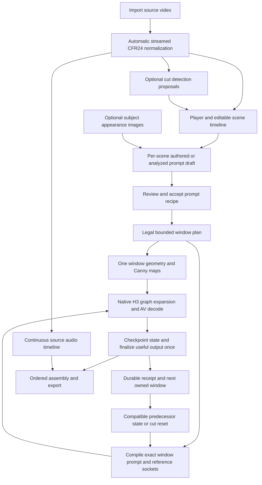

# Future ready-workflow specification

**PROPOSED, NOT EXECUTABLE.** This document and its diagram are not a ComfyUI workflow JSON. No KVD nodes are registered or implementation present. The upstream native template is a source recipe, not our ready product workflow or a tested installation. **GPU NOT PERFORMED**. Future assets must meet the acceptance below before README can call them ready.

## User flow and proposed wiring

This is acyclic **per window**. The conceptual next-window arrow is serial orchestration between ordinary owned prompts, not a circular graph connection to the current sampler. The bounded native subgraph does not recursively submit HTTP requests. [Catalog](NODE_CATALOG.md) IDs map to the flow: N02/N03 import/normalize; N04–N09 timeline and prompts; N10/N11 planning/compilation; N12–N16 render; N17–N20 optional state/finalization; N21/N22 coordination; N23–N26 export/review/persistence/preflight; N28 release validation.

M1 uses authored prompts, Canny, empty reference/guide/inpaint sockets, no continuation, preserve source audio at assembly, and a matching control-off variant. Large timeline development follows a real short proof. M2 adds the editor/runner, then scene prompt automation, optional identity refs and tested within-shot continuation. Hard cuts reset predecessor AV state, while subject-image bindings can persist.

## Future assets

Paths below are **new proposed outputs of future cards**, absent now. Asset names become final only after real node registration and schema review.

| Future path / variant | Contents required before delivery | Owning gate |
|---|---|---|
| `workflows/m1_short_v2v.json` | Small diagnostic native graph, source relink, real CFR24/plan/Canny/finalizer, no refs/context; paired off configuration | M1-03 authoring, M1-04 real validation; diagnostic until accepted |
| `workflows/v2v_basic.json` | Real project/timeline/runner/export nodes, automatic normalization, editable manual prompts, serial arbitrary-duration planning/recovery, no-ref path | M2-06 after checked editor/runner |
| `workflows/v2v_scene_prompts.json` | Optional detector/VLM/enhancer branches, manual fallback, editable accepted recipes, scoped unload completion before H3 | M2-06 after M2-03 receipts |
| `workflows/v2v_identity_continuity.json` | Explicit image library/bindings, compatible reference profile, measured motion context with cut resets, exactly-once trimming/checkpoints | M2-06 after M2-04/05 receipts |
| `workflows/v2v_controls.json` | Only individually validated Depth/Pose/Gray profiles; mixed controls only when supported and tested | M3-01 updates release assets |
| `workflows/create_video_modes.json` | Tested native T2VA/I2VA/FL2VA/L2VA/Ref2VA routes and mode-specific guides/references | M3-02 updates release assets |
| `docs/workflows/SETUP.md` and `docs/validation/WORKFLOWS.md` | Dependencies, exact supported version/profile matrix, license/attribution, relink/setup steps, actual per-variant receipts/limitations | M2-06, updated by later outcome owners |

Workflow UI JSON and API prompt JSON, if both provided, must be generated from the same registered node interfaces and checked for matching inputs. Embedded labels/groups explain source/control/appearance/state/audio paths, without fake node classes. Defaults use small openly licensed synthetic fixtures or user-selected local media; no personal video/model weights embedded, auto-downloads or paid endpoint required. External models/extensions remain explicit optional dependencies.

## Acceptance for the word ready

1. **Reproducible load:** import each delivered workflow in the recorded ComfyUI core/frontend pair. All node types and socket signatures resolve. Pin extension/component revisions and model hashes/conversion metadata; readable missing-node/model errors precede execution. Test an approved Windows environment; do not infer its versions from upstream HEAD or a worktree.
2. **Real first run:** user selects a local clip, normalization starts automatically, actual output is CFR24, and the basic variant produces a checked H3 result without references. The supplied no-ref variant uses no source RGB/audio ref, guide or inpaint inputs. Record actual controlled/control-off outputs; model quality is reviewed separately from successful execution.
3. **Editable timeline:** source player/scale/cursor and scene markers are real; moving/deleting/numeric boundaries preserves coverage. Adjacent scenes retain different prompts. Detection overlays remain proposals until accepted. Technical-window overlay never masquerades as scene boundaries. Save/reload preserves IDs, edits, paths and missing-asset recovery.
4. **Automation:** a supported VLM sees recorded bounded time samples, produces provenance/uncertainty-bearing SceneAnalysis, and supplies a visible editable draft. Optional text enhancement preserves authored intent and supplied dialogue. Manual/model-free fallback works with analyzer/enhancer absent. A tested backend is required to accept the automation variant; a mock or unavailable model is BLOCKED, not PASS.
5. **Bindings/continuation:** identity image labels match actual socket order, stable subject IDs survive cuts, and clearing refs restores structural-only generation. Continue within a shot, reset at a hard cut and on incompatible dimensions/profile, and invalidate dependent outputs on predecessor edits. Native Fun ControlNet + refs + state is tested as a combination, not inferred from separate demos. Report drift/seams/identity limitations; no perfect-consistency promise.
6. **Exact delivery:** useful video covers `[0,F)` once, strict N lattice/cap includes all pad/head context, output frame count is F, temporal/spatial padding is removed once, and audio uses absolute sample boundaries with one final encode. Positive/negative audio offsets, codec delay, mute/no audio and generated-audio correction are reported separately. No silent passthrough fills missing output.
7. **Bounded/recoverable operation:** a longer synthetic source with several windows demonstrates one active H3 window and measured RAM/VRAM plateau, disk-budget preflight and safe quota handling. Cancellation keeps completed receipts; refresh/restart reconciles queue/history before retry; failed-window retry does not repeat completed valid windows. Closed browser stops new submissions after the current owned run; durable resume works when reopened. Checkpoint compatibility is validated by hashes/profile, not latest filename.
8. **Honest evidence:** setup/load/CPU/media/browser/GPU results are separately marked PASS/FAIL/BLOCKED/NOT PERFORMED with real receipts. A source template, illustrative JSON, successful queue event or document preview cannot count as H3 success. Sanitize public reports; private media stays local/AO unless explicitly authorized.

`M2-06` accepts the usable V2V collection and real workflows only after these gates. M3 extends the collection with additional validated controls and creation modes. See [PLAN](PLAN.md) and [task cards](tasks/INDEX.md) for checked-commit ordering and sole resource ownership.
